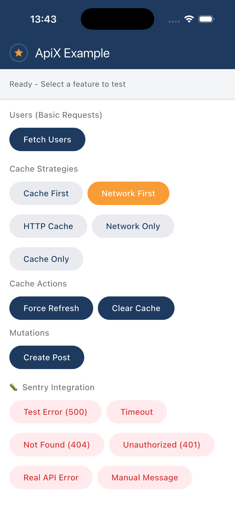

<p align="center">
  
</p>

<h1 align="center">ApiX</h1>

<p align="center">
  <a href="https://pub.dev/packages/apix"></a>
  <a href="https://github.com/Germinator97/apix/actions/workflows/ci.yaml"></a>
  <a href="https://codecov.io/gh/Germinator97/apix"></a>
  <a href="https://opensource.org/licenses/MIT"></a>
</p>

<p align="center">
  Production-ready Flutter/Dart API client with auth refresh queue, exponential retry, smart caching and error tracking (Sentry-ready). Powered by <a href="https://pub.dev/packages/dio">Dio</a>.
</p>

---

## Why ApiX?

Flutter developers spend considerable time reimplementing the same patterns: refresh token, retry, cache, error handling. **ApiX** combines all of this into a turnkey solution.

| Problem | ApiX Solution |
|---------|---------------|
| Refresh token race conditions | **Automatic refresh queue** |
| Manual retry with backoff | **Built-in RetryInterceptor** |
| Complex cache configuration | **Ready-to-use strategies** |
| Poorly typed errors | **Granular exception hierarchy** |

---

## Quick Start

```dart
import 'package:apix/apix.dart';

// Simple - works immediately
final client = ApiClientFactory.create(baseUrl: 'https://api.example.com');
final response = await client.get<Map<String, dynamic>>('/users');
```

**30 seconds** from `pub add` to your first request.

---

## Installation

```yaml
dependencies:
  apix: ^1.1.1
```

```bash
flutter pub get
```

---

## Full Configuration

ApiX supports declarative configuration with 6 optional parameters:

```dart
final tokenProvider = SecureTokenProvider();

final client = ApiClientFactory.create(
  baseUrl: 'https://api.example.com',
  
  // 🔐 Authentication with automatic refresh
  authConfig: AuthConfig(
    tokenProvider: tokenProvider,
    refreshEndpoint: '/auth/refresh',
    onTokenRefreshed: (response) async {
      final data = response.data as Map<String, dynamic>;
      await tokenProvider.saveTokens(
        data['access_token'] as String,
        data['refresh_token'] as String,
      );
    },
  ),
  
  // 🔄 Retry with exponential backoff
  retryConfig: const RetryConfig(
    maxAttempts: 3,
    retryStatusCodes: [500, 502, 503, 504],
  ),
  
  // 💾 Smart caching
  cacheConfig: CacheConfig(
    strategy: CacheStrategy.networkFirst,
    defaultTtl: const Duration(minutes: 5),
  ),
  
  // 📊 Configurable logging
  loggerConfig: const LoggerConfig(
    level: LogLevel.info,
    redactedHeaders: ['Authorization'],
  ),
  
  // 🐛 Error tracking (Sentry, Crashlytics, etc.)
  errorTrackingConfig: ErrorTrackingConfig(
    onError: (e, {stackTrace, extra, tags}) async {
      // Sentry
      await Sentry.captureException(e, stackTrace: stackTrace);

      // Firebase Crashlytics
      FirebaseCrashlytics.instance.recordError(e, stackTrace);

      // Custom / Debug
      debugPrint('Error: $e');
    },
  ),
  
  // 📈 Request metrics (Firebase, Amplitude, etc.)
  metricsConfig: const MetricsConfig(
    onMetrics: (metrics) {
      // Example with your analytics service
      debugPrint('${metrics.method} ${metrics.path} - ${metrics.durationMs}ms');
    },
  ),
);
```

---

## Features

### 🔐 Authentication & Secure Storage

```dart
// SecureTokenProvider uses flutter_secure_storage
final tokenProvider = SecureTokenProvider();

final client = ApiClientFactory.create(
  baseUrl: 'https://api.example.com',
  authConfig: AuthConfig(
    tokenProvider: tokenProvider,
    refreshEndpoint: '/auth/refresh',
    onTokenRefreshed: (response) async {
      final data = response.data as Map<String, dynamic>;
      await tokenProvider.saveTokens(
        data['access_token'] as String,
        data['refresh_token'] as String,
      );
    },
  ),
);

// After login
await tokenProvider.saveTokens(accessToken, refreshToken);

// Logout
await tokenProvider.clearTokens();
```

**Refresh token queue**: If multiple requests fail with 401, only one refresh is triggered and all requests wait then retry automatically.

---

### 🔄 Retry with Exponential Backoff

```dart
final client = ApiClientFactory.create(
  baseUrl: 'https://api.example.com',
  retryConfig: const RetryConfig(
    maxAttempts: 3,
    retryStatusCodes: [500, 502, 503, 504],
    baseDelayMs: 1000,
    multiplier: 2.0,  // 1s → 2s → 4s
  ),
);

// Disable retry for a specific request
final response = await client.get<Map<String, dynamic>>(
  '/critical-endpoint',
  options: Options(extra: {noRetryKey: true}),
);
```

---

### 💾 Smart Caching

```dart
final client = ApiClientFactory.create(
  baseUrl: 'https://api.example.com',
  cacheConfig: CacheConfig(
    strategy: CacheStrategy.networkFirst,
    defaultTtl: const Duration(minutes: 5),
  ),
);

// Override per request
final config = await client.get<Map<String, dynamic>>(
  '/app-config',
  options: Options(extra: {
    'cacheStrategy': CacheStrategy.cacheFirst,
    'cacheTtl': const Duration(hours: 24),
  }),
);

// Force refresh
final fresh = await client.get<Map<String, dynamic>>(
  '/users',
  options: Options(extra: {'forceRefresh': true}),
);
```

| Strategy | Behavior |
|----------|----------|
| `cacheFirst` | Cache first, network in background |
| `networkFirst` | Network first, fallback to cache |
| `cacheOnly` | Cache only |
| `networkOnly` | Network only |

---

### 📊 Logging

```dart
final client = ApiClientFactory.create(
  baseUrl: 'https://api.example.com',
  loggerConfig: const LoggerConfig(
    level: LogLevel.info,
    redactedHeaders: ['Authorization', 'Cookie'],
  ),
);
```

| Level | Description |
|-------|-------------|
| `none` | No logs |
| `error` | Errors only |
| `warn` | Warnings + errors |
| `info` | Info + warnings + errors |
| `trace` | Everything (debug) |

---

### 🐛 Sentry Integration

**1. Sentry initialization (in `main.dart`):**

```dart
void main() async {
  await SentrySetup.init(
    options: SentrySetupOptions.production(
      dsn: 'https://xxx@xxx.ingest.sentry.io/xxx',
    ),
    appRunner: () => runApp(const MyApp()),
  );
}

// Or development mode (no traces/replays)
await SentrySetup.init(
  options: SentrySetupOptions.development(
    dsn: 'your-sentry-dsn',
  ),
  appRunner: () => runApp(const MyApp()),
);
```

**2. API client configuration:**

```dart
final client = ApiClientFactory.create(
  baseUrl: 'https://api.example.com',
  errorTrackingConfig: ErrorTrackingConfig(
    onError: (e, {stackTrace, extra, tags}) async {
      await Sentry.captureException(
        e,
        stackTrace: stackTrace,
        withScope: (scope) {
          extra?.forEach((key, value) => scope.setExtra(key, value));
          tags?.forEach((key, value) => scope.setTag(key, value));
        },
      );
    },
    onBreadcrumb: (data) {
      Sentry.addBreadcrumb(Breadcrumb(
        message: data['message'] as String?,
        category: data['category'] as String?,
        data: data['data'] as Map<String, dynamic>?,
      ));
    },
  ),
);
```

| Option | Description |
|--------|-------------|
| `captureStatusCodes` | HTTP status codes to capture (default: 5xx) |
| `captureRequestBody` | Include request body (default: false) |
| `captureResponseBody` | Include response body (default: true) |
| `redactedHeaders` | Headers to redact (Authorization, Cookie...) |

---

## Error Handling

### Automatic Error Transformation

ApiX automatically transforms all Dio errors into typed exceptions via `ErrorMapperInterceptor` (added automatically):

| Dio Error | ApiX Exception |
|------------|----------------|
| `connectionTimeout`, `sendTimeout`, `receiveTimeout` | `TimeoutException` |
| `connectionError` | `ConnectionException` |
| HTTP 401 | `UnauthorizedException` |
| HTTP 403 | `ForbiddenException` |
| HTTP 404 | `NotFoundException` |
| HTTP 4xx/5xx | `HttpException` |

The **message** is automatically extracted from the API response (`message`, `error`, `detail`, `error_description`) or falls back to `"HTTP {statusCode}"`.

### Exception Hierarchy

```
ApiException
├── NetworkException
│   ├── TimeoutException
│   └── ConnectionException
└── HttpException
    ├── ClientException (4xx)
    │   ├── UnauthorizedException (401)
    │   ├── ForbiddenException (403)
    │   └── NotFoundException (404)
    └── ServerException (5xx)
```

### Classic Try-catch

```dart
try {
  final response = await client.get<Map<String, dynamic>>('/users');
} on NotFoundException catch (e) {
  print('User not found: ${e.message}');
} on UnauthorizedException catch (e) {
  print('Please login again');
} on NetworkException catch (e) {
  print('Check your connection: ${e.message}');
} on ApiException catch (e) {
  print('API error: ${e.message}');
}
```

### Result Pattern (Functional)

```dart
final result = await client.get<Map<String, dynamic>>('/users').getResult();

result.when(
  success: (response) => print('Got ${response.data}'),
  failure: (error) => print('Error: ${error.message}'),
);

// Or with pattern matching
if (result.isSuccess) {
  final data = result.valueOrNull;
}
```

---

## API Reference

### ApiClientFactory.create

| Parameter | Type | Description |
|-----------|------|-------------|
| `baseUrl` | `String` | Base URL (required) |
| `connectTimeout` | `Duration` | Connection timeout (30s) |
| `receiveTimeout` | `Duration` | Receive timeout (30s) |
| `headers` | `Map<String, dynamic>` | Default headers |
| `authConfig` | `AuthConfig?` | Auth configuration |
| `retryConfig` | `RetryConfig?` | Retry configuration |
| `cacheConfig` | `CacheConfig?` | Cache configuration |
| `loggerConfig` | `LoggerConfig?` | Logging configuration |
| `errorTrackingConfig` | `ErrorTrackingConfig?` | Error tracking configuration |
| `metricsConfig` | `MetricsConfig?` | Metrics configuration |
| `interceptors` | `List<Interceptor>?` | Custom interceptors |

### Built-in Interceptors

| Interceptor | Added via | Description |
|-------------|-----------|-------------|
| `AuthInterceptor` | `authConfig` | Token injection + refresh queue |
| `RetryInterceptor` | `retryConfig` | Retry with backoff |
| `CacheInterceptor` | `cacheConfig` | Multi-strategy cache |
| `LoggerInterceptor` | `loggerConfig` | Request/response logging |
| `ErrorTrackingInterceptor` | `errorTrackingConfig` | Error tracking |
| `MetricsInterceptor` | `metricsConfig` | Request metrics |
| `ErrorMapperInterceptor` | Automatic | Transforms DioException → ApiException |

---

## Example App

A complete Flutter app demonstrating all ApiX features is available on GitHub:

👉 **[apix_example_app](https://github.com/Germinator97/apix_example_app)**

<p align="center">
  
</p>

Features demonstrated:
- 🔐 SecureTokenProvider with simplified refresh flow
- 💾 Cache strategies (CacheFirst, NetworkFirst, HttpCache)
- 🔄 Retry logic with exponential backoff
- 🐛 Sentry integration with error testing
- 📊 Request metrics and logging

## Contributing

Contributions are welcome! Please read our [contributing guidelines](CONTRIBUTING.md) first.

1. Fork the repository
2. Create your feature branch (`git checkout -b feature/amazing-feature`)
3. Commit your changes (`git commit -m 'feat: add amazing feature'`)
4. Push to the branch (`git push origin feature/amazing-feature`)
5. Open a Pull Request

## License

This project is licensed under the MIT License - see the [LICENSE](LICENSE) file for details.

## Acknowledgments

- Built on top of [Dio](https://pub.dev/packages/dio)
- Inspired by best practices from production Flutter apps

---

<p align="center">
  Made with ❤️ by <a href="https://github.com/Germinator97">Germinator</a>
</p>
