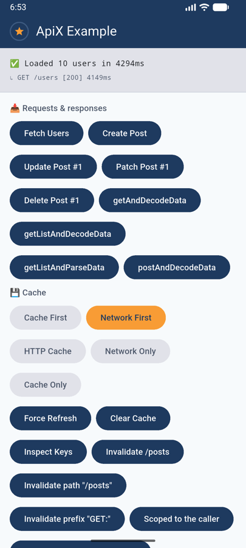

<p align="center">
  
</p>

<h1 align="center">ApiX</h1>

<p align="center">
  <a href="https://pub.dev/packages/apix"></a>
  <a href="https://github.com/Germinator97/apix/actions/workflows/ci.yaml"></a>
  <a href="https://codecov.io/gh/Germinator97/apix"></a>
  <a href="https://opensource.org/licenses/MIT"></a>
</p>

<p align="center">
  Production-ready Flutter/Dart API client with auth refresh queue, exponential retry, smart caching and error tracking (Sentry-ready). Powered by <a href="https://pub.dev/packages/dio">Dio</a>.
</p>

---

## Why ApiX?

Flutter developers spend considerable time reimplementing the same patterns: refresh token, retry, cache, error handling. **ApiX** combines all of this into a turnkey solution.

| Problem | ApiX Solution |
|---------|---------------|
| Refresh token race conditions | **Automatic refresh queue** |
| Manual retry with backoff | **Built-in RetryInterceptor** |
| Complex cache configuration | **Ready-to-use strategies** |
| Poorly typed errors | **Granular exception hierarchy** |

---

## Quick Start

```dart
import 'package:apix/apix.dart';

// Simple - works immediately
final client = ApiClientFactory.create(baseUrl: 'https://api.example.com');
final response = await client.get<Map<String, dynamic>>('/users');
```

**30 seconds** from `pub add` to your first request.

---

## Installation

```yaml
dependencies:
  apix: ^2.3.0
```

```bash
flutter pub get
```

---

## Full Configuration

ApiX supports declarative configuration with 6 optional parameters:

```dart
final tokenProvider = SecureTokenProvider();

final client = ApiClientFactory.create(
  baseUrl: 'https://api.example.com',
  
  // 🔐 Authentication with automatic refresh
  authConfig: AuthConfig(
    tokenProvider: tokenProvider,
    refreshEndpoint: '/auth/refresh',
    onTokenRefreshed: (response) async {
      final data = response.data as Map<String, dynamic>;
      await tokenProvider.saveTokens(
        data['access_token'] as String,
        data['refresh_token'] as String,
      );
    },
    onAuthFailure: (tokenProvider, error) async {
      await tokenProvider.clearTokens();
      // Navigate to login, show dialog, etc.
    },
  ),
  
  // 🔄 Retry with exponential backoff
  // Idempotent methods only by default — POST/PATCH are NOT replayed.
  retryConfig: const RetryConfig(
    maxAttempts: 3,
    retryStatusCodes: [500, 502, 503, 504],
    maxDelayMs: 30000, // Cap at 30s
  ),
  
  // 💾 Smart caching
  cacheConfig: CacheConfig(
    strategy: CacheStrategy.networkFirst,
    defaultTtl: const Duration(minutes: 5),
  ),
  
  // 📊 Configurable logging
  loggerConfig: const LoggerConfig(
    level: LogLevel.info,
    redactedHeaders: ['Authorization'],
  ),
  
  // 🐛 Error tracking (SentrySetup helper, Firebase Crashlytics)
  errorTrackingConfig: ErrorTrackingConfig(
    onError: (e, {stackTrace, extra, tags}) async {
      // SentrySetup
      await SentrySetup.captureException(
        e,
        stackTrace: stackTrace,
        extra: extra,
        tags: tags,
      );

      // Firebase Crashlytics
      FirebaseCrashlytics.instance.recordError(e, stackTrace);

      // Custom / Debug
      debugPrint('Error: $e');
    },
  ),
  
  // 📈 Request metrics (Firebase, Amplitude, etc.)
  metricsConfig: const MetricsConfig(
    onMetrics: (metrics) {
      // Example with your analytics service
      debugPrint('${metrics.method} ${metrics.path} - ${metrics.durationMs}ms');
    },
  ),
);
```

---

## Features

### 🔐 Authentication & Secure Storage

```dart
// SecureTokenProvider uses flutter_secure_storage
final tokenProvider = SecureTokenProvider();

final client = ApiClientFactory.create(
  baseUrl: 'https://api.example.com',
  authConfig: AuthConfig(
    tokenProvider: tokenProvider,
    refreshEndpoint: '/auth/refresh',
    onTokenRefreshed: (response) async {
      final data = response.data as Map<String, dynamic>;
      await tokenProvider.saveTokens(
        data['access_token'] as String,
        data['refresh_token'] as String,
      );
    },
    // Called when refresh fails — clear tokens and redirect to login
    onAuthFailure: (tokenProvider, error) async {
      debugPrint('Auth failed: $error');
      await tokenProvider.clearTokens();
      // router.go('/login');
    },
  ),
);

// After login
await tokenProvider.saveTokens(accessToken, refreshToken);

// Logout
await tokenProvider.clearTokens();
```

**Refresh token queue**: If multiple requests fail with 401, only one refresh is triggered and all requests wait then retry automatically. If refresh fails, `onAuthFailure` is called **once** (not per queued request).

**Network resilience**: When the refresh request itself fails with a connection or timeout error, the original request is rejected with `NetworkException` (typed: `ConnectionException`, `TimeoutException`) — `onAuthFailure` is **not** invoked, so a connectivity blip never logs the user out. Real auth failures (401/403 from the refresh endpoint) still trigger `AuthException` and call `onAuthFailure`.

**Token storage failures**: Errors raised by your `TokenProvider` (corrupted keychain, missing entitlements, ...) surface as `TokenProviderException` — see [Error Handling](#error-handling).

---

### 🔄 Retry with Exponential Backoff

```dart
final client = ApiClientFactory.create(
  baseUrl: 'https://api.example.com',
  retryConfig: const RetryConfig(
    maxAttempts: 3,
    retryStatusCodes: [500, 502, 503, 504],
    baseDelayMs: 1000,
    multiplier: 2.0,  // 1s → 2s → 4s
    maxDelayMs: 30000, // Never wait more than 30s
    respectRetryAfter: true, // Honor Retry-After header (default)
    // Idempotent methods only (RFC 7231 §4.2.2) — POST/PATCH excluded (default)
    retryableMethods: {'GET', 'HEAD', 'OPTIONS', 'TRACE', 'PUT', 'DELETE'},
  ),
);

// Disable retry for a specific request
final response = await client.get<Map<String, dynamic>>(
  '/critical-endpoint',
  options: Options(extra: {noRetryKey: true}),
);

// Force-retry a non-idempotent request that is safe to replay
// (e.g. a POST protected by an Idempotency-Key)
final topup = await client.post<Map<String, dynamic>>(
  '/wallet/topups',
  data: payload,
  options: Options(
    headers: {'Idempotency-Key': idempotencyKey},
    extra: {forceRetryKey: true},
  ),
);
```

**Method-aware retry (idempotency)**: retry only replays requests whose method is in `retryableMethods`, which defaults to the **idempotent** methods per RFC 7231 §4.2.2 (`GET, HEAD, OPTIONS, TRACE, PUT, DELETE`). **`POST` and `PATCH` are excluded by default** — replaying them after a `5xx` that the server may already have committed (e.g. a gateway `502`/`504`) would duplicate the side effect (double charge). To retry a non-idempotent request that is provably safe to replay, opt in per request with `forceRetryKey` (or `RequestOptions.forceRetry()`); it overrides the method guard only.

**`Retry-After` header (RFC 7231 §7.1.3)**: when `respectRetryAfter` is `true` (default), responses carrying a `Retry-After` header — typically on `429 Too Many Requests` or `503 Service Unavailable` — are honored. Both delta-seconds (`"60"`) and HTTP-date (`"Wed, 21 Oct 2026 07:28:00 GMT"`) formats are parsed. The resolved delay is capped at `maxDelayMs`. Falls back to exponential backoff if the header is absent or malformed.

---

### 💾 Smart Caching

```dart
final client = ApiClientFactory.create(
  baseUrl: 'https://api.example.com',
  cacheConfig: CacheConfig(
    strategy: CacheStrategy.networkFirst,
    defaultTtl: const Duration(minutes: 5),
  ),
);

// Override per request
final config = await client.get<Map<String, dynamic>>(
  '/app-config',
  options: Options(extra: {
    'cacheStrategy': CacheStrategy.cacheFirst,
    'cacheTtl': const Duration(hours: 24),
  }),
);

// Force refresh
final fresh = await client.get<Map<String, dynamic>>(
  '/users',
  options: Options(extra: {'forceRefresh': true}),
);
```

| Strategy | Behavior |
|----------|----------|
| `cacheFirst` | Cache first, network in background |
| `networkFirst` | Network first, fallback to cache |
| `cacheOnly` | Cache only |
| `networkOnly` | Network only |

---

### 📊 Logging

```dart
final client = ApiClientFactory.create(
  baseUrl: 'https://api.example.com',
  loggerConfig: const LoggerConfig(
    level: LogLevel.info,
    redactedHeaders: ['Authorization', 'Cookie'],
  ),
);
```

| Level | Description |
|-------|-------------|
| `none` | No logs |
| `error` | Errors only |
| `warn` | Warnings + errors |
| `info` | Info + warnings + errors |
| `trace` | Everything (debug) |

---

### 🐛 Sentry Integration

**1. Sentry initialization (in `main.dart`):**

```dart
void main() async {
  await SentrySetup.init(
    options: SentrySetupOptions.production(
      dsn: 'https://xxx@xxx.ingest.sentry.io/xxx',
    ),
    appRunner: () => runApp(const MyApp()),
  );
}

// Or development mode (no traces/replays)
await SentrySetup.init(
  options: SentrySetupOptions.development(
    dsn: 'your-sentry-dsn',
  ),
  appRunner: () => runApp(const MyApp()),
);
```

**Tuning Sentry options not exposed by apix** — use `configureOptions` as an escape hatch:

```dart
await SentrySetup.init(
  options: SentrySetupOptions(
    dsn: 'https://xxx@xxx.ingest.sentry.io/xxx',
    environment: 'production',
    configureOptions: (sentryOptions) {
      sentryOptions.enableTombstone = true; // sentry_flutter >= 9.14
    },
  ),
  appRunner: () => runApp(const MyApp()),
);
```

> The callback runs **after** every apix default, so it can override anything — including `beforeSend`. For composition that preserves apix's network-noise filter, prefer `customBeforeSend` / `customBeforeSendTransaction`.
>
> ⚠️ `SentrySetupOptions.production()` and `.development()` do **not** forward `configureOptions`. To use it, spell the options out with the full constructor as above — the factories are only shorthands for the sample-rate presets.

**2. API client configuration:**

```dart
final client = ApiClientFactory.create(
  baseUrl: 'https://api.example.com',
  errorTrackingConfig: ErrorTrackingConfig(
    onError: SentrySetup.captureException,
    onBreadcrumb: SentrySetup.addBreadcrumbFromMap,
  ),
);
```

**Network-noise filter**: `SentrySetupOptions.filterNetworkNoise` (default `true`) drops transport-level noise before it reaches Sentry — `SocketException`, TLS handshake failures, and apix's own `NetworkException` subtypes (`TimeoutException`, `ConnectionException`). Every other `ApiException` — including `ClientException` and `ServerException` — is **always reported**: apix classifies its own errors by type hierarchy, never by type name, so a 5xx is never mistaken for a socket error that happens to share a class name.

| Option | Description |
|--------|-------------|
| `captureStatusCodes` | HTTP status codes to capture (default: 5xx) |
| `captureRequestBody` | Include request body (default: false) |
| `captureResponseBody` | Include response body (default: true) |
| `redactedHeaders` | Headers to redact (Authorization, Cookie...) |

---

## Error Handling

### Automatic Error Transformation

ApiX automatically transforms all Dio errors into typed exceptions via `ErrorMapperInterceptor` (added automatically):

| Source | ApiX Exception |
|------------|----------------|
| `connectionTimeout`, `sendTimeout`, `receiveTimeout` | `TimeoutException` |
| `connectionError` | `ConnectionException` |
| HTTP 401 | `UnauthorizedException` |
| HTTP 403 | `ForbiddenException` |
| HTTP 404 | `NotFoundException` |
| HTTP 4xx (other) | `ClientException` |
| HTTP 5xx | `ServerException` |
| Other status on the error path (3xx, unknown) | `HttpException` |
| `*AndDecode` / `*AndParse` parse failure | `ParsingException` |
| `TokenProvider` failure (keychain, custom impl) | `TokenProviderException` |
| Wrong `Content-Type` (with `strictContentType: true`) | `UnexpectedContentTypeException` |

The **message** is automatically extracted from the API response body. Supports flat and nested formats:

```
{ "message": "Bad request" }                       → "Bad request"
{ "detail": "Not found" }                          → "Not found"
{ "error": "Access denied" }                       → "Access denied"
{ "error": { "message": "Invalid credentials" } }  → "Invalid credentials"
{ "error": { "detail": "..." } }                   → "..."
```

Falls back to `"HTTP {statusCode}"` if no known field is found.

### Exception Hierarchy

```
ApiException
├── NetworkException
│   ├── TimeoutException
│   └── ConnectionException
├── HttpException
│   ├── ClientException (4xx)
│   │   ├── UnauthorizedException (401)
│   │   │   └── AuthException (refresh failure)
│   │   ├── ForbiddenException (403)
│   │   └── NotFoundException (404)
│   └── ServerException (5xx)
├── ParsingException (decode / parse failure)
├── TokenProviderException (TokenProvider failure)
└── UnexpectedContentTypeException (strictContentType only)
```

Every 4xx maps to a `ClientException` and every 5xx to a `ServerException`, so
branching on the category works whether or not the status has a dedicated
subclass:

```dart
try {
  await client.get<Map<String, dynamic>>('/orders');
} on NotFoundException {
  // 404 — the specific subclass still wins
} on ClientException catch (e) {
  // any other 4xx: 400, 409, 422, 429... — e.statusCode tells you which
} on ServerException catch (e) {
  // any 5xx — retryable, worth reporting
}
```

`AuthException` exposes `originalError` so the underlying cause (e.g. `TokenProviderException` or a custom error from a legacy `onRefresh`) is recoverable.

### Classic Try-catch

ApiClient methods throw typed `ApiException` directly — no need to unwrap `DioException`:

```dart
try {
  final response = await client.get<Map<String, dynamic>>('/users');
} on NotFoundException catch (e) {
  print('User not found: ${e.message}');
} on UnauthorizedException catch (e) {
  print('Please login again');
} on NetworkException catch (e) {
  print('Check your connection: ${e.message}');
} on ApiException catch (e) {
  print('API error: ${e.message}');
}
```

### Result Pattern (Functional)

```dart
final result = await client.get<Map<String, dynamic>>('/users').getResult();

result.when(
  success: (response) => print('Got ${response.data}'),
  failure: (error) => print('Error: ${error.message}'),
);

// Or with fold
final message = result.fold(
  onSuccess: (response) => 'Got ${response.data}',
  onFailure: (error) => 'Error: ${error.message}',
);
```

### Validating 2xx Responses (Legacy APIs)

Some APIs signal business errors via HTTP 200 with a payload like
`{ "success": false, "error": "..." }`. The `responseValidator` hook lets you
turn that into a typed `ApiException` so it flows through the same `try/catch`
as HTTP errors:

```dart
final client = ApiClientFactory.create(
  baseUrl: 'https://api.example.com',
  responseValidator: (response) {
    final body = response.data;
    if (body is Map && body['success'] == false) {
      return ApiException(
        message: body['message'] as String? ?? 'Unknown error',
        statusCode: response.statusCode,
      );
    }
    return null; // pass through
  },
);
```

The validator only fires on 2xx responses. Returning `null` lets the response
through unchanged. Returning any `ApiException` subclass (including custom
ones) preserves the exact type for `on YourException catch`.

---

## Typed Response Methods

ApiX provides **3 levels** of response handling, from raw to fully typed with envelope unwrapping.

### Level 1: Standard — Raw `Response<T>`

```dart
final response = await client.get<Map<String, dynamic>>('/users/1');
final data = response.data; // Map<String, dynamic>
```

Available for all HTTP verbs: `get`, `post`, `put`, `delete`, `patch`.

### Level 2: Parse & Decode — Format `response.data`

Directly formats `response.data` (non-nullable). Available for all verbs.

```dart
// Decode: Map<String, dynamic> → typed object (tear-off friendly)
final user = await client.getAndDecode('/users/1', User.fromJson);

// Parse: dynamic → any type (flexible)
final count = await client.getAndParse('/users/count', (data) => data as int);

// POST variants
final created = await client.postAndDecode('/users', {'name': 'John'}, User.fromJson);
final token = await client.postAndParse('/auth', creds, (data) => data as String);

// PUT / PATCH also available
final updated = await client.putAndDecode('/users/1', body, User.fromJson);
final patched = await client.patchAndDecode('/users/1', body, User.fromJson);
```

### Level 3: Data Methods — Envelope Unwrapping

For APIs that wrap responses in an envelope like `{ "data": { ... } }`.
Extracts `response.data[dataKey]` then formats. **GET & POST only.**

```dart
// Configure dataKey globally (default: 'data')
final client = ApiClientFactory.create(
  baseUrl: 'https://api.example.com',
  // dataKey defaults to 'data', customize if needed:
  // Use ApiClientConfig(baseUrl: '...', dataKey: 'result') for { "result": { ... } }
);
```

#### Single Object

```dart
// Response: { "data": { "id": 1, "name": "John" } }
final user = await client.getAndDecodeData('/users/1', User.fromJson);

// Response: { "data": null } → returns null
final user = await client.getAndDecodeDataOrNull('/users/1', User.fromJson);

// Parse variant for non-JSON types
// Response: { "data": "2024-01-01T00:00:00Z" }
final date = await client.getAndParseData('/time', (d) => DateTime.parse(d as String));
final date = await client.getAndParseDataOrNull('/time', (d) => DateTime.parse(d as String));
```

#### Lists

```dart
// Response: { "data": [{ "id": 1 }, { "id": 2 }] }
final users = await client.getListAndDecodeData('/users', User.fromJson);
final users = await client.getListAndDecodeDataOrNull('/users', User.fromJson); // null if data is null
final users = await client.getListAndDecodeDataOrEmpty('/users', User.fromJson); // [] if data is null

// Response: { "data": ["admin", "editor"] }
final roles = await client.getListAndParseData('/roles', (item) => item as String);
final roles = await client.getListAndParseDataOrNull('/roles', (item) => item as String);
final roles = await client.getListAndParseDataOrEmpty('/roles', (item) => item as String);
```

#### POST Data

```dart
// Response: { "data": { "id": 1, "name": "John" } }
final user = await client.postAndDecodeData('/users', {'name': 'John'}, User.fromJson);
final user = await client.postAndDecodeDataOrNull('/users', body, User.fromJson);

// List responses
final results = await client.postListAndDecodeData('/search', query, User.fromJson);
final results = await client.postListAndDecodeDataOrEmpty('/search', query, User.fromJson);
```

### Method Summary

| Level | Methods | Source | Verbs | Variants |
|-------|---------|--------|-------|----------|
| **Standard** | `get`, `post`, `put`, `delete`, `patch` | `Response<T>` | all | — |
| **Parse/Decode** | `{verb}AndParse`, `{verb}AndDecode` | `response.data` | all | non-nullable only |
| **Data** | `{verb}And{Parse\|Decode}Data` | `response.data[dataKey]` | GET, POST | OrNull, List, ListOrNull, ListOrEmpty |

### Strict Content-Type Checks (Captive Portals)

`*AndDecode` methods can verify that the response's `Content-Type` starts
with `application/json` before attempting to parse. Useful in fintech /
mobile contexts where a captive Wi-Fi portal may return HTML 200 in place
of the expected JSON:

```dart
final client = ApiClientFactory.create(
  baseUrl: 'https://api.example.com',
  strictContentType: true, // opt-in (default: false)
);

try {
  final user = await client.getAndDecode('/me', User.fromJson);
} on UnexpectedContentTypeException catch (e) {
  // e.expectedContentType, e.actualContentType available
  // Likely a captive portal — surface a "check your network" UI
}
```

`*AndParse` methods are unaffected (they accept any payload type by design).
A missing `Content-Type` header in strict mode triggers the same exception
with `actualContentType: null`.

---

## API Reference

### ApiClientFactory.create

| Parameter | Type | Description |
|-----------|------|-------------|
| `baseUrl` | `String` | Base URL (required) |
| `connectTimeout` | `Duration` | Connection timeout (30s) |
| `receiveTimeout` | `Duration` | Receive timeout (30s) |
| `sendTimeout` | `Duration` | Send timeout (30s) |
| `defaultContentType` | `String?` | Default `Content-Type` (`application/json`) |
| `headers` | `Map<String, dynamic>?` | Default headers |
| `dataKey` | `String` | Envelope key for `*Data` methods (`'data'`) |
| `strictContentType` | `bool` | Enforce `application/json` on `*AndDecode` (false) |
| `responseValidator` | `ResponseValidator?` | Hook to validate 2xx responses |
| `authConfig` | `AuthConfig?` | Auth configuration |
| `retryConfig` | `RetryConfig?` | Retry configuration |
| `cacheConfig` | `CacheConfig?` | Cache configuration |
| `loggerConfig` | `LoggerConfig?` | Logging configuration |
| `errorTrackingConfig` | `ErrorTrackingConfig?` | Error tracking configuration |
| `metricsConfig` | `MetricsConfig?` | Metrics configuration |
| `interceptors` | `List<Interceptor>?` | Custom interceptors |
| `httpClientAdapter` | `HttpClientAdapter?` | Custom Dio adapter |

### ApiClientConfig

| Parameter | Type | Default | Description |
|-----------|------|---------|-------------|
| `baseUrl` | `String` | required | Base URL for all requests |
| `connectTimeout` | `Duration` | 30s | Connection timeout |
| `receiveTimeout` | `Duration` | 30s | Receive timeout |
| `sendTimeout` | `Duration` | 30s | Send timeout |
| `headers` | `Map<String, dynamic>?` | null | Default headers |
| `defaultContentType` | `String?` | `'application/json'` | Default content type |
| `interceptors` | `List<Interceptor>?` | null | Custom interceptors |
| `dataKey` | `String` | `'data'` | Key for envelope unwrapping in `*Data` methods |
| `strictContentType` | `bool` | `false` | Throw `UnexpectedContentTypeException` when `*AndDecode` receives a non-JSON response |
| `responseValidator` | `ResponseValidator?` | null | Inspect 2xx responses; return an `ApiException` to fail the request |

### Built-in Interceptors

| Interceptor | Added via | Description |
|-------------|-----------|-------------|
| `AuthInterceptor` | `authConfig` | Token injection + refresh queue |
| `RetryInterceptor` | `retryConfig` | Retry with backoff |
| `CacheInterceptor` | `cacheConfig` | Multi-strategy cache |
| `LoggerInterceptor` | `loggerConfig` | Request/response logging |
| `ErrorTrackingInterceptor` | `errorTrackingConfig` | Error tracking |
| `MetricsInterceptor` | `metricsConfig` | Request metrics |
| `ErrorMapperInterceptor` | Automatic | Transforms DioException → ApiException |

---

## Example App

A complete Flutter app demonstrating all ApiX features is available on GitHub:

👉 **[apix_example_app](https://github.com/Germinator97/apix_example_app)**

<p align="center">
  
</p>

Features demonstrated:
- 🔐 SecureTokenProvider with simplified refresh flow
- 💾 Cache strategies (CacheFirst, NetworkFirst, HttpCache) + invalidation API
- 🔄 Retry: exponential backoff, `Retry-After`, and the method-aware guard — three live probes measure how many times the server is actually hit for `GET`, `POST` and `POST` + `forceRetry()`
- 🛡️ Typed failures: `ParsingException`, `UnexpectedContentTypeException`, `responseValidator` → custom exception, `TokenProviderException`
- 📦 Envelope API (`*Data` methods) against a mocked backend
- 🐛 Sentry integration with error testing
- 📊 Request metrics and logging

> A shorter, single-file example lives in [`example/example.dart`](example/example.dart) — that is the one rendered on pub.dev. The linked repo is the full Flutter app.

## Contributing

Contributions are welcome! Please read our [contributing guidelines](CONTRIBUTING.md) first.

1. Fork the repository
2. Create your feature branch (`git checkout -b feature/amazing-feature`)
3. Commit your changes (`git commit -m 'feat: add amazing feature'`)
4. Push to the branch (`git push origin feature/amazing-feature`)
5. Open a Pull Request

## License

This project is licensed under the MIT License - see the [LICENSE](LICENSE) file for details.

## Acknowledgments

- Built on top of [Dio](https://pub.dev/packages/dio)
- Inspired by best practices from production Flutter apps

---

<p align="center">
  Made with ❤️ by <a href="https://github.com/Germinator97">Germinator</a>
</p>
