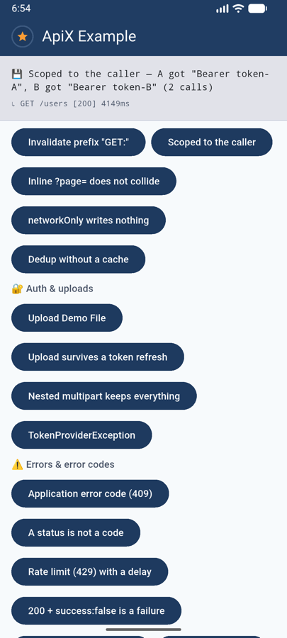
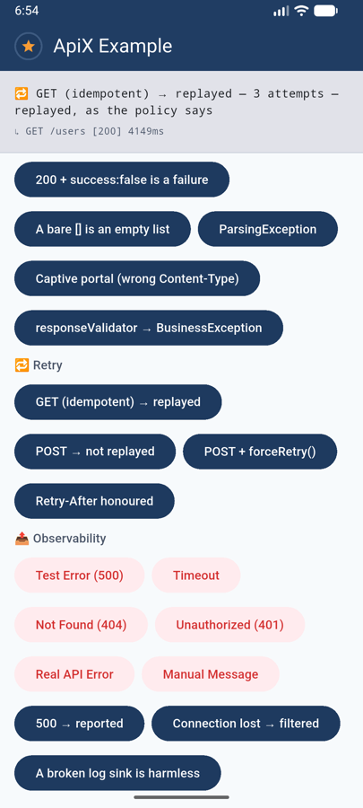

<p align="center">
  
</p>

<h1 align="center">ApiX</h1>

<p align="center">
  <a href="https://pub.dev/packages/apix"></a>
  <a href="https://github.com/Germinator97/apix/actions/workflows/ci.yaml?query=branch%3Adevelop"></a>
  <a href="https://codecov.io/gh/Germinator97/apix"></a>
  <a href="https://opensource.org/licenses/MIT"></a>
</p>

<p align="center">
  Production-ready Flutter/Dart API client with auth refresh queue, exponential retry, smart caching and error tracking (Sentry-ready). Powered by <a href="https://pub.dev/packages/dio">Dio</a>.
</p>

---

## Why ApiX?

Flutter developers spend considerable time reimplementing the same patterns: refresh token, retry, cache, error handling. **ApiX** combines all of this into a turnkey solution.

| Problem | ApiX Solution |
|---------|---------------|
| Refresh token race conditions | **Automatic refresh queue** |
| Manual retry with backoff | **Built-in RetryInterceptor** |
| Complex cache configuration | **Ready-to-use strategies** |
| Poorly typed errors | **Granular exception hierarchy** |

---

## Quick Start

```dart
import 'package:apix/apix.dart';

// Simple - works immediately
final client = ApiClientFactory.create(baseUrl: 'https://api.example.com');
final response = await client.get<Map<String, dynamic>>('/users');
```

**30 seconds** from `pub add` to your first request.

---

## Installation

```yaml
dependencies:
  apix: ^5.2.0
```

```bash
flutter pub get
```

---

## Full Configuration

ApiX supports declarative configuration with 8 optional config blocks:

```dart
final tokenProvider = SecureTokenProvider();

final client = ApiClientFactory.create(
  baseUrl: 'https://api.example.com',
  
  // 🔐 Authentication with automatic refresh
  authConfig: AuthConfig(
    tokenProvider: tokenProvider,
    refreshEndpoint: '/auth/refresh',
    onTokenRefreshed: (response) async {
      final data = response.data as Map<String, dynamic>;
      await tokenProvider.saveTokens(
        data['access_token'] as String,
        data['refresh_token'] as String,
      );
    },
    onAuthFailure: (tokenProvider, error) async {
      await tokenProvider.clearTokens();
      // Navigate to login, show dialog, etc.
    },
  ),
  
  // 🔄 Retry with exponential backoff
  // Idempotent methods only by default — POST/PATCH are NOT replayed.
  retryConfig: const RetryConfig(
    maxAttempts: 3,
    retryStatusCodes: [500, 502, 503, 504],
    maxDelayMs: 30000, // Cap at 30s
  ),
  
  // 💾 Smart caching
  cacheConfig: CacheConfig(
    strategy: CacheStrategy.networkFirst,
    defaultTtl: const Duration(minutes: 5),
  ),
  
  // 📊 Configurable logging
  loggerConfig: const LoggerConfig(
    level: LogLevel.info,
    redactedHeaders: ['Authorization'],
  ),
  
  // 🐛 Error tracking (SentrySetup helper, Firebase Crashlytics)
  errorTrackingConfig: ErrorTrackingConfig(
    onError: (e, {stackTrace, extra, tags}) async {
      // SentrySetup
      await SentrySetup.captureException(
        e,
        stackTrace: stackTrace,
        extra: extra,
        tags: tags,
      );

      // Firebase Crashlytics
      FirebaseCrashlytics.instance.recordError(e, stackTrace);

      // Custom / Debug
      debugPrint('Error: $e');
    },
  ),
  
  // 📈 Request metrics (Firebase, Amplitude, etc.)
  metricsConfig: const MetricsConfig(
    onMetrics: (metrics) {
      // Example with your analytics service
      debugPrint('${metrics.method} ${metrics.path} - ${metrics.durationMs}ms');
    },
  ),

  // 🔗 Collapse identical concurrent requests — independent of the cache,
  // so you can have this without storing anything.
  deduplicationConfig: const DeduplicationConfig(),

  // ⏱️ One performance span per request, under the current Sentry transaction
  tracingConfig: const TracingConfig(),
);
```

---

## Features

### 🔐 Authentication & Secure Storage

```dart
// SecureTokenProvider uses flutter_secure_storage
final tokenProvider = SecureTokenProvider();

final client = ApiClientFactory.create(
  baseUrl: 'https://api.example.com',
  authConfig: AuthConfig(
    tokenProvider: tokenProvider,
    refreshEndpoint: '/auth/refresh',
    onTokenRefreshed: (response) async {
      final data = response.data as Map<String, dynamic>;
      await tokenProvider.saveTokens(
        data['access_token'] as String,
        data['refresh_token'] as String,
      );
    },
    // Called when refresh fails — clear tokens and redirect to login
    onAuthFailure: (tokenProvider, error) async {
      debugPrint('Auth failed: $error');
      await tokenProvider.clearTokens();
      // router.go('/login');
    },
  ),
);

// After login
await tokenProvider.saveTokens(accessToken, refreshToken);

// Logout — drop the tokens AND the responses they fetched
await tokenProvider.clearTokens();
await client.cacheInterceptor?.clearCache();
```

> **Clearing the cache on logout is not optional.** Cache entries are scoped by
> `CacheConfig.varyHeaders` (default `['Authorization']`), so the next account
> cannot *read* the previous one's entries — but they are still on the device
> until something removes them, and `FileCacheStorage` keeps them across
> restarts. Clear them where you clear the tokens.
>
> `client.cacheInterceptor` is how you reach the invalidation API —
> `clearCache()`, `invalidateUrl()`, `invalidatePath()` — on the instance the
> client actually uses. It returns `null` when no `cacheConfig` was given.

**Refresh token queue**: If multiple requests fail with 401, only one refresh is triggered and all requests wait then retry automatically. If refresh fails, `onAuthFailure` is called **once** (not per queued request).

**Network resilience**: When the refresh request itself fails with a connection or timeout error, the original request is rejected with `NetworkException` (typed: `ConnectionException`, `TimeoutException`) — `onAuthFailure` is **not** invoked, so a connectivity blip never logs the user out. Real auth failures (401/403 from the refresh endpoint) still trigger `AuthException` and call `onAuthFailure`.

**Token storage failures**: Errors raised by your `TokenProvider` (corrupted keychain, missing entitlements, ...) surface as `TokenProviderException` — see [Error Handling](#error-handling).

#### When the keychain deletes your user's session

`SecureStorageService` recovers from an entry it cannot decrypt — bytes that no
longer match their key — by **deleting it**: the affected key on a `read`, and
the whole store on a `readAll`. That is the right call, since undecryptable
bytes never become readable and re-reading them forever is worse. (A restored
backup is a different failure, and apix does not delete on it: see below.)

But the decision rests on matching substrings against a platform exception's
message, and a false positive here does not degrade a feature — it **logs a user
out**, indistinguishably from a session that expired on its own. Nothing else
can report it: the recovery swallows the exception, writes no log, and the next
read simply misses.

```dart
final storage = SecureStorageService(
  onBeforeRecoveryDelete: (event) => Sentry.captureMessage(
    'secure storage purge: ${event.operation.name} '
    '${event.isFullWipe ? "(whole store)" : event.key}',
    level: SentryLevel.warning,
  ),
);
final tokenProvider = SecureTokenProvider(storage: storage);
```

Fires **before** the deletion, so you can snapshot what is about to go.
`isFullWipe` separates one lost key from a lost session without parsing
anything, and `event.error` carries the exception whose message triggered the
decision — worth capturing verbatim, since those recognised substrings are the
real contract of this component.

Those substrings have now been checked against the platform rather than assumed.
A genuine decryption failure, staged on an Android 16 emulator by flipping one
byte of the stored ciphertext, raises:

```text
javax.crypto.AEADBadTagException:
  error:1e000065:Cipher functions:OPENSSL_internal:BAD_DECRYPT
```

which two of them match. **This is also why apix passes `resetOnError: false`.**
Left at the plugin's own default, the Android plugin deletes the entry and
retries the read itself: you still get `null`, and the callback above never
fires while the credential is destroyed. If you inject your own
`FlutterSecureStorage`, keep `resetOnError: false` or this channel goes quiet.
The trade-off is that a failed initialisation raises instead of resetting.

Requested by a consumer whose support desk receives "it logged me out" with no
way to reach a string in a platform message.

#### The failure apix does *not* delete on

There are two failures here, not one, and they need opposite reactions:

| `SecureStorageFailure` | What happened | What apix does |
| --- | --- | --- |
| `unreadableEntry` | One entry's bytes no longer decrypt. The store is fine. | Drops the key (or the store, on `readAll`), announces it, answers `null` / `false` / `{}`. |
| `storeUnusable` | The store's **own key** cannot be used. Nothing in it can be read, written **or deleted** through the plugin. | Rethrows. Never deletes, never answers `null`. |
| `other` | A cancelled prompt, a locked keychain, anything else. | Rethrows. |

The second one is the trap, because the plugin reports both as a
`PlatformException` with the same `code: 'Exception encountered'`, and its
message for a dead store can itself contain the words `Bad padding`:

```text
Key mismatch after algorithm change (Bad padding, wrong key for cipher
algorithm). Enable migrateOnAlgorithmChange=true to preserve data, ...
```

apix used to read that as a corrupted entry and take a deletion that
**cannot run** — the Android plugin executes `read`, `write`, `delete` and
`deleteAll` only inside a successful `initialize`, so the cleanup fails for the
same reason the read did. You got a purge report for a purge that never
happened, and the cleanup's exception in place of the one that named the cause.

`SecureStorageService.classify` is that decision, exposed so you do not have to
redo the substring matching on your side:

```dart
try {
  token = await storage.read('apix_access_token');
} on PlatformException catch (e) {
  if (SecureStorageService.classify(e) == SecureStorageFailure.storeUnusable) {
    // Nothing to purge. Retry once — see below — and treat a second failure
    // as permanent.
  }
  rethrow;
}
```

**Retry once before doing anything drastic** — on plugin 10.x. Read in its
Android sources rather than measured: when the failure comes from *missing*
algorithm markers, `StorageCipherFactory` writes the current markers as it
builds, so the **next** call no longer takes that branch and the failure clears
itself. From 11.0 a store without markers is taken to use the current
algorithms, and that branch cannot fail. When the markers are present but no
longer match the key, nothing is rewritten and every call fails identically:
that one is permanent until the store is reset, which is what
`resetOnError: true` on your own `FlutterSecureStorage` does — the trade-off
above, taken deliberately.

⚠️ **A purge instance binds the store for the rest of the process.** From plugin
10.2.0 the Android side keeps one instance per preferences store
(`FlutterSecureStoragePlugin.getOrCreateStorage`) — per store and key prefix from
11.2.0 — and its `initialize` returns early on an already-initialised store
*before* re-reading the options. So a second `FlutterSecureStorage` you create
just to purge, with
`resetOnError: true` and no store name of its own, shares apix's store — and
once its call succeeds, **its** `resetOnError` governs every later call,
apix's included. It has to share that store for the purge to reach anything, so
this is a consequence rather than a mistake: know that for the remainder of that
process `onBeforeRecoveryDelete` stays quiet — and, up to plugin 10.2.x, a write
that fails after a broken initialisation is reported as a success. Restart the
process after the purge rather than carrying on inside it.

⚠️ **One envelope, several causes.** `Migration failed after algorithm change
(…)` is also what a `SecureStorageService.withBiometrics()` refusal looks like —
from the first call on an Android 11 (API 30) emulator with no lock screen,
`BIOMETRIC_UNAVAILABLE` buried in the `Caused by:` chain. No retry and no purge
clears that one: the device has nothing to prompt for. The `(%s)` narrows it
down — `Invalid key, …` for a restored backup, `Algorithm changed detected` for
that refusal as for markers naming another algorithm — but only the
`Caused by:` chain says for sure, and it reaches you in the exception and in
`SecureStorageRecovery.error`.

#### A restored backup makes the store unusable — keep the plugin's files out of it

Android Auto Backup restores the plugin's preference files after a reinstall or
on a new phone — the data, the algorithm markers and the wrapped key — but not
the Keystore key that wrapped it: that one never leaves the device. From then on
every call fails, on every launch:

```text
Migration failed after algorithm change (Invalid key, key type incompatible with
cipher). Enable resetOnError=true or call deleteAll().
```

`storeUnusable`, and no retry clears it. Measured on an Android 11 (API 30)
emulator at plugin 10.3.1 and 11.2.0, by backing an app up, uninstalling it and
reinstalling it. A "clear app data" does **not** cause it: that removes the
Keystore key along with the preferences, and the next launch simply starts empty.

Exclude the plugin's files from backup — all of them: the wrapped key and the
markers restored without the data fail the same way. For the default store:

```xml
<!-- android/app/src/main/AndroidManifest.xml -->
<application
    android:fullBackupContent="@xml/secure_storage_backup_rules"
    android:dataExtractionRules="@xml/secure_storage_data_extraction_rules"
    ...>

<!-- android/app/src/main/res/xml/secure_storage_backup_rules.xml (Android 11 and lower) -->
<full-backup-content>
    <exclude domain="sharedpref" path="FlutterSecureStorage.xml" />
    <exclude domain="sharedpref" path="FlutterSecureKeyStorage.xml" />
    <exclude domain="sharedpref" path="FlutterSecureStorageConfiguration.xml" />
    <exclude domain="sharedpref" path="FlutterSecureStorageConfiguration:FlutterSecureStorage.xml" />
</full-backup-content>

<!-- android/app/src/main/res/xml/secure_storage_data_extraction_rules.xml (Android 12+):
     the same four excludes, in both <cloud-backup> and <device-transfer> -->
```

With these rules, the same backup-and-reinstall starts from an empty store — the
user signs in again instead of being locked out. Measured on API 30, which reads
`fullBackupContent`; `dataExtractionRules` is what Android 12 and later read, and
was not measured here. A store you named yourself adds its own files; so does
`storageNamespace`. The plugin's own README suggests `android:allowBackup="false"`,
which also works — at the price of every other file in the app.

Already locked out? The purge above — your own `FlutterSecureStorage` on the same
store, with `resetOnError: true` — reset it in the same measurement, and the next
process wrote and read again. What was stored is gone either way: its key is.

---

### 🔄 Retry with Exponential Backoff

```dart
final client = ApiClientFactory.create(
  baseUrl: 'https://api.example.com',
  retryConfig: const RetryConfig(
    maxAttempts: 3,
    retryStatusCodes: [500, 502, 503, 504],
    baseDelayMs: 1000,
    multiplier: 2.0,  // 1s → 2s → 4s, each spread by jitter
    maxDelayMs: 30000, // Never wait more than 30s
    respectRetryAfter: true, // Honor Retry-After header (default)
    jitter: 0.2, // ±20 % spread, ON by default — 0.0 disables it
    // Idempotent methods only (RFC 7231 §4.2.2) — POST/PATCH excluded (default)
    retryableMethods: {'GET', 'HEAD', 'OPTIONS', 'TRACE', 'PUT', 'DELETE'},
  ),
  // Observe every retry — route it to a breadcrumb and a storm stops being
  // invisible.
  onRetry: (attempt) => Sentry.addBreadcrumb(Breadcrumb(
    message: 'retry #${attempt.attempt} in ${attempt.delay.inMilliseconds}ms '
        '(status ${attempt.statusCode})',
    category: 'http',
  )),
);

// Disable retry for a specific request
final response = await client.get<Map<String, dynamic>>(
  '/critical-endpoint',
  options: Options(extra: {noRetryKey: true}),
);

// Force-retry a non-idempotent request that is safe to replay
// (e.g. a POST protected by an Idempotency-Key)
final order = await client.post<Map<String, dynamic>>(
  '/orders',
  data: payload,
  options: Options(
    headers: {'Idempotency-Key': idempotencyKey},
    extra: {forceRetryKey: true},
  ),
);
```

**Method-aware retry (idempotency)**: retry only replays requests whose method is in `retryableMethods`, which defaults to the **idempotent** methods per RFC 7231 §4.2.2 (`GET, HEAD, OPTIONS, TRACE, PUT, DELETE`). **`POST` and `PATCH` are excluded by default** — replaying them after a `5xx` that the server may already have committed (e.g. a gateway `502`/`504`) would duplicate the side effect (the same order placed twice). To retry a non-idempotent request that is provably safe to replay, opt in per request with `forceRetryKey` (or `RequestOptions.forceRetry()`); it overrides the method guard only.

**Jitter (on by default)**: a purely deterministic backoff makes every client
that failed during the same outage second retry at exactly the same instants, so
a server coming back up meets a synchronised spike. `jitter` spreads each delay
uniformly across ±20 % of itself. Set `jitter: 0.0` for the strictly
deterministic sequence — and note that any test asserting an exact delay needs
it. A server-named `Retry-After` is never jittered.

**`Retry-After` header (RFC 7231 §7.1.3)**: when `respectRetryAfter` is `true` (default), responses carrying a `Retry-After` header — typically on `429 Too Many Requests` or `503 Service Unavailable` — are honored. Both delta-seconds (`"60"`) and HTTP-date (`"Wed, 21 Oct 2026 07:28:00 GMT"`) formats are parsed. The resolved delay is capped at `maxDelayMs`. Falls back to exponential backoff if the header is absent or malformed.

---

### 💾 Smart Caching

```dart
final client = ApiClientFactory.create(
  baseUrl: 'https://api.example.com',
  cacheConfig: CacheConfig(
    strategy: CacheStrategy.networkFirst,
    defaultTtl: const Duration(minutes: 5),
  ),
);

// Override the strategy for one request
final config = await client.get<Map<String, dynamic>>(
  '/app-config',
  options: Options(extra: {'cacheStrategy': CacheStrategy.cacheFirst}),
);
```

Per-request control is a set of extensions on `RequestOptions`, so you never
have to remember an `extra` key:

```dart
final options = Options().compose(client.dio.options, '/users')
  ..noCache();                              // this one request skips the cache
  // ..setCacheStrategy(CacheStrategy.cacheFirst);
  // ..forceRevalidate();                   // see below
```

> The strategy override above is the one `extra` key apix reads. Earlier
> versions of this README also showed `'cacheTtl'` and `'forceRefresh'`;
> **neither has ever existed in the code**. They were quietly ignored — the
> exact failure mode of an option that looks set. Use `defaultTtl` for the
> lifetime, and `forceRevalidate()` below to force a round trip.

| Strategy | Behavior | Can return stale? |
|----------|----------|-------------------|
| `cacheFirst` | Serve cache immediately, refresh in the background (stale-while-revalidate) | **Yes** — flagged |
| `networkFirst` | Network first, fall back to cache on failure | **Yes**, on fallback — flagged |
| `httpCacheAware` | Follow the server's `Cache-Control` / `ETag` | No (`304` is server-confirmed) |
| `cacheOnly` | Cache only, never network — fails if missing **or expired** | No |
| `networkOnly` | Network only, never read cache | No |

`networkFirst` is the default: configure nothing and you get fresh data.

#### Entries are scoped to whoever asked — `varyHeaders`

**Read this one even if you skip the rest of the section.** A cache key used to
describe *what* was requested and never *who* requested it, so two accounts on
one device shared every entry: log out, log back in as someone else, and
`GET /me` returned the previous account's body. With `FileCacheStorage` that
survived restarts, and the documented logout only dropped the tokens.

`CacheConfig.varyHeaders` defaults to `['Authorization']`, and a truncated
digest of those headers enters the key — never the value, since keys stay in
clear text even under `EncryptedCacheStorage`.

```dart
cacheConfig: CacheConfig(
  varyHeaders: const ['X-User-Id'],  // a stable identity beats a rotating token
),
```

Two consequences worth knowing:

- **A token refresh changes the fingerprint**, so entries cached under the old
  access token stop being hit. That is a cache miss, never a wrong answer —
  vary on a stable identity header to avoid it.
- **The header must already be on the request** when the cache reads it.
  `ApiClientFactory` installs auth before the cache precisely so it is. Wiring
  the cache by hand *before* auth scopes nothing, and scoping nothing looks
  exactly like working.

Set `const []` to opt out, and only where responses genuinely do not depend on
the caller — a public price list, a static catalogue.

#### Knowing what you got

Any response served from the cache says so, and says whether it was past its
TTL:

```dart
final response = await client.get<Map<String, dynamic>>('/orders');

if (response.isFromCache && response.isStale) {
  showBanner('Showing data from earlier — refreshing…');
}
```

`isStale` is true in the two places apix knowingly returns expired data:
`cacheFirst` serving instantly while it revalidates, and the offline fallback
of `networkFirst` / `httpCacheAware`. Both are useful; both are lies if the
caller can't tell. **On a stock level, a quota or a status, surface it.**

#### Forcing a round trip — `forceRevalidate()`

Under `httpCacheAware`, a fresh entry is served without asking the server. On a
pull-to-refresh the user *has* asked, so `forceRevalidate()` sends the stored
`ETag` as `If-None-Match`: an unchanged resource costs a `304` with no body and
the entry's lifetime restarts.

```dart
final response = await client.get<Map<String, dynamic>>(
  '/orders',
  options: Options(extra: {forceRevalidateKey: true}),
);
// or, on a RequestOptions you already hold:  options.forceRevalidate();
```

Cheaper than `noCache()`, which throws the entry away and downloads the body
again.

#### A cache hit keeps the type it had

A body comes back as the type the network gave you — a `text/plain` payload
stays a `String`, a `ResponseType.bytes` download stays bytes. `CacheEntry`
records which of `CacheBodyEncoding.json`, `.text`, `.bytes` or `.empty` was
used, so the round trip through storage is not a `jsonEncode`/`jsonDecode` pair
that turns `"12345"` into an `int` on the second request only.

You never set this — it is recorded for you. It is public because a custom
`CacheStorage` receives it and must persist it alongside the body; drop it and
every entry decodes as JSON again.

#### Seeing the cache work

A hit resolves before the logger, the metrics and the tracing interceptor, so
none of them ever sees one — deliberately, since a cached response spent no
time on the network. The consequence is that your fastest requests are missing
from every dashboard, and the hit rate is not visible from the observability
apix ships. Two callbacks close that:

```dart
cacheConfig: CacheConfig(
  storage: FileCacheStorage(dir),
  onCacheHit: (hit) => analytics.count(
    hit.isStale ? 'cache.stale' : 'cache.fresh',
  ),
  onCacheError: (failure) => Sentry.captureException(
    failure.error,
    stackTrace: failure.stackTrace,
  ),
),
```

`onCacheError` matters more than it looks. The cache falls back to the network
on any storage failure — correct, and unchanged — but a backend that refuses
*every* operation then degrades the client to "no cache" permanently, with every
request still succeeding. Without this callback there is no moment at which
anyone finds out.

#### Removing what expired

`getCacheKeys()` only reads. Use `evictExpired()` when you want the sweep:

```dart
final removed = await client.cacheInterceptor!.evictExpired();
```

Worth calling at logout or on a memory-pressure signal; not worth calling
routinely, since `FileCacheStorage` bounds itself by count and an expired entry
is still what serves the user when the network is gone.

#### The TTL is a guarantee

`defaultTtl` is enforced by the interceptor, not by the storage backend — a
custom `CacheStorage` cannot weaken it by forgetting to filter. Backends just
store and return; deciding what to do with an expired entry is the strategy's
job.

#### Persistent cache

`InMemoryCacheStorage` (the default) starts empty on every launch, so it does
nothing for a cold start — which is exactly when the wait is most visible.
`FileCacheStorage` survives restarts and pulls in **no extra dependency**: you
hand it the directory.

```dart
final dir = await getTemporaryDirectory(); // path_provider, in your app
final client = ApiClientFactory.create(
  baseUrl: 'https://api.example.com',
  cacheConfig: CacheConfig(
    storage: FileCacheStorage(Directory('${dir.path}/apix_cache')),
    strategy: CacheStrategy.cacheFirst,
  ),
);
```

> ⚠️ Entries are stored **in clear text**. Never cache credentials, tokens,
> or personal data you would not write to a log. Prefer a cache
> directory the OS may purge over a backed-up documents directory.

---

### 🔗 Deduplication without a cache

Deduplication collapses identical concurrent requests into one call. It says
nothing about whether responses should be *stored*, so it no longer requires a
cache:

```dart
final client = ApiClientFactory.create(
  baseUrl: 'https://api.example.com',
  deduplicationConfig: const DeduplicationConfig(),
  // no cacheConfig — nothing is ever written anywhere
);
```

Three widgets asking for the same profile at once produce one request. A later,
sequential request still hits the network: this is about concurrency, not
caching.

When both `deduplicationConfig` and `cacheConfig` are supplied, the cache's own
deduplication is switched off so a request is not collapsed twice.

### 🔒 Encrypted cache

`FileCacheStorage` writes in clear text. Where the data worth keeping between
launches is also the data that must not leak, wrap it:

```dart
final storage = EncryptedCacheStorage(
  delegate: FileCacheStorage(dir),
  encrypt: (plain) => myCipher.encrypt(plain),
  decrypt: (sealed) => myCipher.decrypt(sealed),
);
```

You supply the cipher, so apix carries neither a crypto dependency nor your key.

Body and headers are sealed. **Cache keys are not** — the whole invalidation API
reads them (`removeByPrefix`, `invalidateUrl`), so an identifying path or query
parameter stays readable on disk. Keep those out of the URL, or don't cache that
endpoint. Status, timestamps and ETag stay readable too, so expiry can be checked
without a key.

An entry that cannot be decrypted — rotated key, corrupted file — reads as a miss
and is purged, rather than throwing on the request path.

### ⏱️ Performance spans

```dart
final client = ApiClientFactory.create(
  baseUrl: 'https://api.example.com',
  tracingConfig: const TracingConfig(),
);
```

Opens one span per request as a child of the current Sentry transaction, with
method, host, path and final status. One span covers the whole logical
request — retries and backoff included — because that is what the caller waited
for. A response served from cache opens none: it spent no time on the network.

Requires an active transaction (`tracesSampleRate` > 0 in `SentrySetup`);
without one, nothing is traced.

### 📦 No dio import required

apix re-exports the dio types its own API hands back, so consumer code — and,
more to the point, consumer *tests* — need not depend on `package:dio`
directly. That matters beyond convenience: a direct import makes apix's
declared dio version range a constraint on your code too.

```dart
import 'package:apix/apix.dart';

// A raw binary call — `getAndReadBytes` does this for you, headers included
final raw = await client.get<List<int>>(
  '/files/report.pdf',
  options: Options(responseType: ResponseType.bytes),
);

// A custom interceptor — `create(interceptors:)` takes a List<Interceptor>
class TenantInterceptor extends Interceptor {
  @override
  void onRequest(RequestOptions options, RequestInterceptorHandler handler) {
    options.headers['X-Tenant'] = currentTenant;
    handler.next(options);
  }
}

// Uploads
final form = FormData.fromMap({'file': await MultipartFile.fromFile(path)});
```

Covered: `Response`, `Options`, `CancelToken`, `ResponseType`,
`RequestOptions`, `Interceptor` and its three handlers, `DioException`,
`DioExceptionType`, `FormData`, `MultipartFile`, `Headers`.

#### Testing without I/O

Adapter stubbing lives in a separate entry point, kept out of production
autocomplete:

```dart
import 'package:apix/apix.dart';
import 'package:apix/testing.dart';

class FakeAdapter implements HttpClientAdapter {
  @override
  Future<ResponseBody> fetch(
    RequestOptions options,
    Stream<List<int>>? requestStream,
    Future<dynamic>? cancelFuture,
  ) async =>
      ResponseBody.fromString(
        '{"code":"RATE_LIMITED","message":"Slow down"}',
        429,
        headers: {
          Headers.contentTypeHeader: ['application/json'],
          'retry-after': ['30'],
        },
      );

  @override
  void close({bool force = false}) {}
}

final client = ApiClientFactory.create(
  baseUrl: 'https://api.test',
  httpClientAdapter: FakeAdapter(),
);
```

### 🛟 Observability never breaks the request

Every callback you hand apix — `logHandler`, `onMetrics`, `onBreadcrumb`,
`onError`, `onRetry`, `startSpan` — is a side channel. If yours throws, or
fails asynchronously, the request carries on and its own outcome reaches you
unchanged:

```dart
final client = ApiClientFactory.create(
  baseUrl: 'https://api.example.com',
  // Your log sink is down. The request still returns 200.
  loggerConfig: LoggerConfig(logHandler: (_) => throw StateError('sink down')),
);
```

Failures are swallowed and deliberately not reported anywhere: the only
channel available for reporting is the one that just failed, and routing it
back would risk a loop.

A request is also observed **once**, even when deduplication makes it travel
the interceptor chain twice — so one cancelled request is one log line and one
tracker event, not two.

### 📊 Logging

```dart
final client = ApiClientFactory.create(
  baseUrl: 'https://api.example.com',
  loggerConfig: const LoggerConfig(
    level: LogLevel.info,
    redactedHeaders: ['Authorization', 'Cookie'],
  ),
);
```

| Level | Description |
|-------|-------------|
| `none` | No logs |
| `error` | Errors only |
| `warn` | Warnings + errors |
| `info` | Info + warnings + errors |
| `trace` | Everything (debug) |

A body is printed in at most `maxBodyLength` characters and never rendered
beyond them: a `Uint8List` — a download, an upload — prints
`<binary: N bytes>`, and a large JSON body costs only what is shown. The
fields `ErrorTrackingConfig` sends are rendered the same way.

---

### 🐛 Sentry Integration

**1. Sentry initialization (in `main.dart`):**

```dart
void main() async {
  await SentrySetup.init(
    options: SentrySetupOptions.production(
      dsn: 'https://xxx@xxx.ingest.sentry.io/xxx',
    ),
    appRunner: () => runApp(const MyApp()),
  );
}

// Or development mode (no traces/replays)
await SentrySetup.init(
  options: SentrySetupOptions.development(
    dsn: 'your-sentry-dsn',
  ),
  appRunner: () => runApp(const MyApp()),
);
```

**Tuning Sentry options not exposed by apix** — use `configureOptions` as an escape hatch:

```dart
await SentrySetup.init(
  options: SentrySetupOptions(
    dsn: 'https://xxx@xxx.ingest.sentry.io/xxx',
    environment: 'production',
    configureOptions: (sentryOptions) {
      sentryOptions.enableTombstone = true; // sentry_flutter >= 9.14
    },
  ),
  appRunner: () => runApp(const MyApp()),
);
```

> The callback runs **after** every apix default, so it can override anything — including `beforeSend`. For composition that preserves apix's network-noise filter, prefer `customBeforeSend` / `customBeforeSendTransaction`.
>
> ⚠️ `SentrySetupOptions.production()` and `.development()` do **not** forward `configureOptions`. To use it, spell the options out with the full constructor as above — the factories are only shorthands for the sample-rate presets.

**2. API client configuration:**

```dart
final client = ApiClientFactory.create(
  baseUrl: 'https://api.example.com',
  errorTrackingConfig: ErrorTrackingConfig(
    onError: SentrySetup.captureException,
    onBreadcrumb: SentrySetup.addBreadcrumbFromMap,
  ),
);
```

**What `onError` receives**: the **typed `ApiException`** — `ServerException`, `NotFoundException`, `ConnectionException`, ... — not the underlying `DioException`. Trackers group issues by the exception's runtime type, so a single `DioException` for everything would file every 500, 404 and timeout under one issue. The original is still reachable through `(exception as ApiException).originalError`.

**Network-noise filter**: `SentrySetupOptions.filterNetworkNoise` (default `true`) drops transport-level noise before it reaches Sentry — `SocketException`, TLS handshake failures, and apix's own `NetworkException` subtypes (`TimeoutException`, `ConnectionException`). Every other `ApiException` — including `ClientException` and `ServerException` — is **always reported**: apix classifies its own errors by type hierarchy, never by type name, so a 5xx is never mistaken for a socket error that happens to share a class name.

| Option | Description |
|--------|-------------|
| `captureStatusCodes` | HTTP status codes to capture (default: 5xx) |
| `captureRequestBody` | Include request body (default: **false**) |
| `captureResponseBody` | Include response body (default: **false** since 5.0) |
| `redactedHeaders` | Headers to redact (Authorization, Cookie...) |
| `redactUrls` | Replace query-parameter **values** before a URL is sent (default: `true`) |

> Both bodies are withheld until you ask. `captureResponseBody` used to default
> to `true` while `captureRequestBody` defaulted to `false` — and the response
> body is the one written by the server, which can carry fields the client never
> sent.
>
> `redactUrls` closes a matching gap: this interceptor redacted `Authorization`
> and then sent the whole URI, so a token in a query parameter reached a
> third-party service in clear, past a redaction step that had already run.
> Parameter **names** are kept (`?token=[REDACTED]`), because knowing which
> parameters a failing request carried is most of the value of having the URL.

**3. Upload debug symbols — or your release stack traces are unreadable.**

`sentry_flutter` reports the error; it does **not** upload the symbols needed
to make sense of it. Without this step everything looks fine — events arrive,
nothing fails — but a release stack trace reads:

```
QKa: Provider<Gx> not found for Ez
```

instead of `ProfileScreen: Provider<ProfileBloc> not found for _ProfileScreenView`.
Debug builds are unaffected, so the gap only shows up in production.

```yaml
# pubspec.yaml
dev_dependencies:
  sentry_dart_plugin: ^3.0.0

sentry:
  upload_debug_symbols: true
  upload_source_maps: false
  project: your-project
  org: your-org
```

Credentials go in a **gitignored** `sentry.properties` at the project root —
flat keys, not the `defaults.*` form the `sentry-cli` binary uses:

```properties
org=your-org
project=your-project
auth_token=sntrys_...
```

Then run it after **every release build**, or the symbols on Sentry drift out
of step with the binary your users are running:

```bash
flutter build apk --release
dart run sentry_dart_plugin
```

The token needs the *Project Read & Write* and *Release Admin* scopes, plus
*Organization Read*.

---

## Error Handling

### Automatic Error Transformation

ApiX automatically transforms all Dio errors into typed exceptions via `ErrorMapperInterceptor` (added automatically):

| Source | ApiX Exception |
|------------|----------------|
| `connectionTimeout`, `sendTimeout`, `receiveTimeout` | `TimeoutException` |
| `connectionError` | `ConnectionException` |
| HTTP 401 | `UnauthorizedException` |
| HTTP 403 | `ForbiddenException` |
| HTTP 404 | `NotFoundException` |
| HTTP 4xx (other) | `ClientException` |
| HTTP 5xx | `ServerException` |
| Other status on the error path (3xx, unknown) | `HttpException` |
| A body that does not parse — a typed shape's decoding, or a `2xx` claiming JSON on any verb | `ParsingException` |
| `TokenProvider` failure (keychain, custom impl) | `TokenProviderException` |
| Wrong `Content-Type` (with `strictContentType: true`) | `UnexpectedContentTypeException` |
| A multipart body that cannot be rebuilt for a replay | `MultipartReplayException` |
| `cacheOnly` miss, or an expired entry under it | `CacheException` |

#### `MultipartReplayException` — the one you can act on

A `FormData` is single-use: dio finalizes it into a stream. Two things replay a
request without you asking — the auth interceptor after a token refresh, and
the retry interceptor on a retryable status — and both re-enter with the same
`RequestOptions`.

When you passed a plain `Map` containing `File`s, apix keeps that map and builds
a fresh `FormData` per attempt, so the replay simply works. This exception is
raised only where that is impossible: the body arrived as a `FormData` (or a
caller-built `MultipartFile`) that apix did not build and cannot rebuild.

```dart
try {
  await client.post('/upload', data: formData);
} on MultipartReplayException {
  // Pass a Map of Files instead, so each attempt gets its own body —
  // or opt this request out of replay with options.disableRetry().
}
```

It exists rather than being a silent skip because the alternative was worse:
dio threw a `StateError`, which reached the mapper as type `unknown` and
surfaced as `ApiException: Unknown error` — **replacing** the `500` that had
triggered the replay, so `on ServerException catch` stopped matching.

The **message** is automatically extracted from the API response body. Supports flat and nested formats:

```
{ "message": "Bad request" }                       → "Bad request"
{ "detail": "Not found" }                          → "Not found"
{ "error": "Access denied" }                       → "Access denied"
{ "error": { "message": "Invalid credentials" } }  → "Invalid credentials"
{ "error": { "detail": "..." } }                   → "..."
```

Falls back to `"HTTP {statusCode}"` if no known field is found.

The body is read the same way **whatever the request's `responseType`**: the
JSON error of a `ResponseType.bytes` download, or of a `plain` call, gives its
message and `code` too, provided its `Content-Type` is JSON and it is under
64 KB. `HttpException.responseBody` then holds the decoded JSON; the value dio
received stays on `originalError.response.data`. A `stream` body is left
unread.

A body that claims JSON and does not parse keeps its status: a `401` is still
an `UnauthorizedException` — and still refreshes — with the text in
`responseBody`, and only a `2xx` becomes a `ParsingException`.

### Exception Hierarchy

```
ApiException
├── NetworkException
│   ├── TimeoutException
│   └── ConnectionException
├── HttpException
│   ├── ClientException (4xx)
│   │   ├── UnauthorizedException (401)
│   │   │   └── AuthException (refresh failure)
│   │   ├── ForbiddenException (403)
│   │   ├── NotFoundException (404)
│   │   └── TooManyRequestsException (429, carries `retryAfter`)
│   ├── ServerException (5xx)
│   └── HttpTrackingException (a captured status, see Sentry section)
├── ParsingException (decode / parse failure)
├── TokenProviderException (TokenProvider failure)
└── UnexpectedContentTypeException (strictContentType only)
```

Every 4xx maps to a `ClientException` and every 5xx to a `ServerException`, so
branching on the category works whether or not the status has a dedicated
subclass:

```dart
try {
  await client.get<Map<String, dynamic>>('/orders');
} on NotFoundException {
  // 404 — the specific subclass still wins
} on ClientException catch (e) {
  // any other 4xx: 400, 409, 422, 429... — e.statusCode tells you which
} on ServerException catch (e) {
  // any 5xx — retryable, worth reporting
}
```

### Branching on the application error code

An HTTP status drifts. The same business case can move from `400` to `409` to
`422` across server revisions without changing meaning, and a call site keyed on
the status changes behaviour the day it does. When your backend publishes a
stable code, branch on that instead:

```dart
try {
  await client.post<void>('/orders', data: payload);
} on ApiException catch (e) {
  switch (e.code) {
    case 'OPERATION_NOT_RETRYABLE':
      showFinalFailure();
    case 'OUT_OF_STOCK':
      showAlternatives();
    default:
      showGenericError();
  }
}
```

`code` is read from the response body — flat (`{"code": ...}`) or nested
(`{"error": {"code": ...}}`) — under the key named by `errorCodeKey`
(default `'code'`). It is always a `String`, even when the server sends a
number, so a `switch` never has to care which. It is null on non-HTTP failures,
which have no body to read.

Keep status branching for the cross-cutting cases — `401` refresh, `403`, a
generic `5xx` — or when no code is guaranteed.

> **A code that is just the status is dropped.** Plenty of envelopes fill a
> field named `code` with the HTTP status (`{"code": 401, ...}` on a `401`).
> Reported as a business code, it would restore the coupling this field exists
> to remove — disguised, since `switch (e.code)` would look like business logic.
> apix drops any value equal to the response status, in either spelling. Real
> codes are untouched: `4001` under a `400` comes through.
>
> Point `errorCodeKey` at another field only if your API genuinely publishes
> codes there — **not** as a way to dodge the trap. One API in the wild fills
> the same `code` field with a status on one handler and a real code on another
> (`{"code": 400, ...}` vs `{"code": "VALIDATION_ERROR", "status": 400, ...}`);
> pointing elsewhere to avoid the first would have silently lost the second.

### Rate limits

```dart
on TooManyRequestsException catch (e) {
  final wait = e.retryAfter;
  showMessage(wait == null
      ? 'Trop de tentatives. Réessayez plus tard.'
      : 'Trop de tentatives. Réessayez dans ${wait.inSeconds} s.');
}
```

`retryAfter` is the parsed `Retry-After` header (delta-seconds or HTTP-date), or
null when the server sent none — treat null as *unknown delay*, never as *retry
now*. Sent twice — a gateway and the application both setting it — the longest
delay wins, here and in the retry alike.

`AuthException` exposes `originalError` so the underlying cause (e.g. `TokenProviderException` or a custom error from a legacy `onRefresh`) is recoverable.

### Classic Try-catch

ApiClient methods throw typed `ApiException` directly — no need to unwrap `DioException`:

```dart
try {
  final response = await client.get<Map<String, dynamic>>('/users');
} on NotFoundException catch (e) {
  print('User not found: ${e.message}');
} on UnauthorizedException catch (e) {
  print('Please login again');
} on NetworkException catch (e) {
  print('Check your connection: ${e.message}');
} on ApiException catch (e) {
  print('API error: ${e.message}');
}
```

### Result Pattern (Functional)

```dart
final result = await client.get<Map<String, dynamic>>('/users').getResult();

result.when(
  success: (response) => print('Got ${response.data}'),
  failure: (error) => print('Error: ${error.message}'),
);

// Or with fold
final message = result.fold(
  onSuccess: (response) => 'Got ${response.data}',
  onFailure: (error) => 'Error: ${error.message}',
);
```

### Validating 2xx Responses (Legacy APIs)

Some APIs signal business errors via HTTP 200 with a payload like
`{ "success": false, "error": "..." }`. The `responseValidator` hook lets you
turn that into a typed `ApiException` so it flows through the same `try/catch`
as HTTP errors:

```dart
final client = ApiClientFactory.create(
  baseUrl: 'https://api.example.com',
  responseValidator: (response) {
    final body = response.data;
    if (body is Map && body['success'] == false) {
      return ApiException(
        message: body['message'] as String? ?? 'Unknown error',
        statusCode: response.statusCode,
      );
    }
    return null; // pass through
  },
);
```

The validator only fires on 2xx responses. Returning `null` lets the response
through unchanged. Returning any `ApiException` subclass (including custom
ones) preserves the exact type for `on YourException catch`.

---

## Typed Response Methods

ApiX provides **3 levels** of response handling, from raw to fully typed with envelope unwrapping.

### Level 1: Standard — Raw `Response<T>`

```dart
final response = await client.get<Map<String, dynamic>>('/users/1');
final data = response.data; // Map<String, dynamic>
```

Available for all HTTP verbs: `get`, `post`, `put`, `delete`, `patch`.

### Level 2: Parse & Decode — Format `response.data`

Directly formats `response.data` (non-nullable). Available for all verbs.

```dart
// Decode: Map<String, dynamic> → typed object (tear-off friendly)
final user = await client.getAndDecode('/users/1', User.fromJson);

// Parse: dynamic → any type (flexible)
final count = await client.getAndParse('/users/count', (data) => data as int);

// POST variants
final created = await client.postAndDecode('/users', {'name': 'John'}, User.fromJson);
final token = await client.postAndParse('/auth', creds, (data) => data as String);

// PUT / PATCH also available
final updated = await client.putAndDecode('/users/1', body, User.fromJson);
final patched = await client.patchAndDecode('/users/1', body, User.fromJson);
```

### Level 3: Data Methods — Envelope Unwrapping

For APIs that wrap responses in an envelope like `{ "data": { ... } }`.
Extracts `response.data[dataKey]` then formats. Available for all verbs.

```dart
// Configure dataKey globally (default: 'data')
final client = ApiClientFactory.create(
  baseUrl: 'https://api.example.com',
  // dataKey defaults to 'data', customize if needed:
  // Use ApiClientConfig(baseUrl: '...', dataKey: 'result') for { "result": { ... } }
);
```

#### Single Object

```dart
// Response: { "data": { "id": 1, "name": "John" } }
final user = await client.getAndDecodeData('/users/1', User.fromJson);

// Response: { "data": null } → returns null
final user = await client.getAndDecodeDataOrNull('/users/1', User.fromJson);

// Parse variant for non-JSON types
// Response: { "data": "2024-01-01T00:00:00Z" }
final date = await client.getAndParseData('/time', (d) => DateTime.parse(d as String));
final date = await client.getAndParseDataOrNull('/time', (d) => DateTime.parse(d as String));
```

#### Lists

```dart
// Response: { "data": [{ "id": 1 }, { "id": 2 }] }
final users = await client.getListAndDecodeData('/users', User.fromJson);
final users = await client.getListAndDecodeDataOrNull('/users', User.fromJson); // null if data is null
final users = await client.getListAndDecodeDataOrEmpty('/users', User.fromJson); // [] if data is null

// Response: { "data": ["admin", "editor"] }
final roles = await client.getListAndParseData('/roles', (item) => item as String);
final roles = await client.getListAndParseDataOrNull('/roles', (item) => item as String);
final roles = await client.getListAndParseDataOrEmpty('/roles', (item) => item as String);
```

#### POST Data

```dart
// Response: { "data": { "id": 1, "name": "John" } }
final user = await client.postAndDecodeData('/users', {'name': 'John'}, User.fromJson);
final user = await client.postAndDecodeDataOrNull('/users', body, User.fromJson);

// List responses
final results = await client.postListAndDecodeData('/search', query, User.fromJson);
final results = await client.postListAndDecodeDataOrEmpty('/search', query, User.fromJson);
```

### Binary Downloads — `{verb}AndReadBytes`

A file — a PDF, an image, an archive — comes back as a `BinaryResponse`: the
bytes, byte for byte, with the status and headers none of the other shapes can
reach. No dio type crosses into your data layer.

```dart
final pdf = await client.getAndReadBytes(
  '/reports/2026-08',
  expectedContentTypes: ['application/pdf'],
  options: Options(receiveTimeout: const Duration(minutes: 2)),
);

if (pdf.isEmpty) return;                        // 204, or an empty body
final name = pdf.fileName ?? 'report.pdf';      // Content-Disposition, sanitised
final missing = pdf.header('X-Missing-Items');  // any header, case-insensitive
await File('${dir.path}/$name').writeAsBytes(pdf.bytes);
```

- `ResponseType.bytes` is forced whatever `options` says, and the rest of
  `options` is kept. Forgotten on a raw `get`, it decodes the file as text and
  corrupts it without a word.
- `expectedContentTypes` refuses a non-empty body of another type with
  `UnexpectedContentTypeException` — a captive portal's HTML served as `200`
  would otherwise be saved as your PDF. Parameters (`; charset=…`) are
  ignored and `image/*` matches the family. `Accept` is left alone: narrowing
  it can turn a JSON error into a `406` without a body.
- `fileName` prefers `filename*` (RFC 8187) to `filename`, and is sanitised:
  last path segment only, no control characters, never `.` or `..`. It still
  comes from the server — where the file goes is yours to decide.
- Failures are typed like every other call: a JSON error body gives its
  `message` and `code` although bytes were asked for.
- A `responseValidator` sees the bytes — `response.data` is a `Uint8List` —
  so have it return `null` for what it does not understand.

`postAndReadBytes`, `putAndReadBytes`, `patchAndReadBytes` and
`deleteAndReadBytes` take a body like the other shapes; the bytes are what is
*received*.

### Method Summary

| Level | Methods | Source | Verbs | Variants |
|-------|---------|--------|-------|----------|
| **Standard** | `get`, `post`, `put`, `delete`, `patch` | `Response<T>` | all | — |
| **Parse/Decode** | `{verb}AndParse`, `{verb}AndDecode` | `response.data` | all | non-nullable only |
| **Data** | `{verb}And{Parse\|Decode}Data` | `response.data[dataKey]` | all | OrNull, List, ListOrNull, ListOrEmpty |
| **Binary** | `{verb}AndReadBytes` | the body's bytes, with status and headers | all | — |

Since 5.0 every shape is available on every verb. The table used to claim that
while `PUT` and `PATCH` had two methods each and `DELETE` none, because filling
the gaps meant copying the plumbing five times. It is one shared core now, so a
verb cannot fall behind again.

#### Progress on a typed call

Every typed method takes `onReceiveProgress`, and every body-bearing one
(`POST`, `PUT`, `PATCH`, `DELETE`) also takes `onSendProgress` — so a typed
upload can drive a progress bar without dropping back to `client.post` and
parsing the body by hand:

```dart
final receipt = await client.postAndDecodeData<Receipt>(
  '/documents',
  {'file': File(path), 'label': 'passport'},
  Receipt.fromJson,
  onSendProgress: (sent, total) => setState(() => _progress = sent / total),
);
```

The `GET` variants take only `onReceiveProgress`: a `GET` has nothing to send,
and an option that can never fire is an option that looks set.

### Strict Content-Type Checks (Captive Portals)

`*AndDecode` methods can verify that the response's `Content-Type` starts
with `application/json` before attempting to parse. Useful in mobile
contexts where a captive Wi-Fi portal may return HTML 200 in place of the
expected JSON:

```dart
final client = ApiClientFactory.create(
  baseUrl: 'https://api.example.com',
  strictContentType: true, // opt-in (default: false)
);

try {
  final user = await client.getAndDecode('/me', User.fromJson);
} on UnexpectedContentTypeException catch (e) {
  // e.expectedContentType, e.actualContentType available
  // Likely a captive portal — surface a "check your network" UI
}
```

`*AndParse` methods are unaffected (they accept any payload type by design).
A missing `Content-Type` header in strict mode triggers the same exception
with `actualContentType: null`.

A binary download has its own check, per call: `expectedContentTypes` on
`getAndReadBytes` and its verbs, which raises the same exception — see
*Binary Downloads* above.

---

## API Reference

### ApiClientFactory.create

| Parameter | Type | Description |
|-----------|------|-------------|
| `baseUrl` | `String` | Base URL (required) |
| `connectTimeout` | `Duration` | Connection timeout (30s) |
| `receiveTimeout` | `Duration` | Receive timeout (30s) |
| `sendTimeout` | `Duration` | Send timeout (30s) |
| `defaultContentType` | `String?` | Default `Content-Type` (`application/json`) |
| `headers` | `Map<String, dynamic>?` | Default headers |
| `dataKey` | `String` | Envelope key for `*Data` methods (`'data'`) |
| `errorCodeKey` | `String` | Body key holding the application error code (`'code'`) |
| `strictContentType` | `bool` | Enforce `application/json` on `*AndDecode` (false) |
| `responseValidator` | `ResponseValidator?` | Hook to validate 2xx responses |
| `authConfig` | `AuthConfig?` | Auth configuration |
| `retryConfig` | `RetryConfig?` | Retry configuration |
| `onRetry` | `void Function(RetryAttempt)?` | Called before each retry waits |
| `cacheConfig` | `CacheConfig?` | Cache configuration |
| `deduplicationConfig` | `DeduplicationConfig?` | Standalone deduplication, no cache required |
| `loggerConfig` | `LoggerConfig?` | Logging configuration |
| `errorTrackingConfig` | `ErrorTrackingConfig?` | Error tracking configuration |
| `metricsConfig` | `MetricsConfig?` | Metrics configuration |
| `tracingConfig` | `TracingConfig?` | One performance span per request |
| `interceptors` | `List<Interceptor>?` | Custom interceptors |
| `httpClientAdapter` | `HttpClientAdapter?` | Custom Dio adapter |

### ApiClientConfig

| Parameter | Type | Default | Description |
|-----------|------|---------|-------------|
| `baseUrl` | `String` | required | Base URL for all requests |
| `connectTimeout` | `Duration` | 30s | Connection timeout |
| `receiveTimeout` | `Duration` | 30s | Receive timeout |
| `sendTimeout` | `Duration` | 30s | Send timeout |
| `headers` | `Map<String, dynamic>?` | null | Default headers |
| `defaultContentType` | `String?` | `'application/json'` | Default content type |
| `interceptors` | `List<Interceptor>?` | null | Custom interceptors |
| `dataKey` | `String` | `'data'` | Key for envelope unwrapping in `*Data` methods |
| `errorCodeKey` | `String` | `'code'` | Body key read into `ApiException.code` |
| `strictContentType` | `bool` | `false` | Throw `UnexpectedContentTypeException` when `*AndDecode` receives a non-JSON response |
| `responseValidator` | `ResponseValidator?` | null | Inspect 2xx responses; return an `ApiException` to fail the request |

### Built-in Interceptors

| Interceptor | Added via | Description |
|-------------|-----------|-------------|
| `AuthInterceptor` | `authConfig` | Token injection + refresh queue |
| `RetryInterceptor` | `retryConfig` | Retry with backoff |
| `CacheInterceptor` | `cacheConfig` | Multi-strategy cache |
| `LoggerInterceptor` | `loggerConfig` | Request/response logging |
| `ErrorTrackingInterceptor` | `errorTrackingConfig` | Error tracking |
| `MetricsInterceptor` | `metricsConfig` | Request metrics |
| `ErrorMapperInterceptor` | Automatic | Transforms DioException → ApiException |
| `MultipartInterceptor` | Automatic | `File` in a `Map` → `FormData`, rebuilt per attempt |
| `ResponseValidatorInterceptor` | `responseValidator` | Fails a 2xx your validator refuses |
| `DeduplicationInterceptor` | `deduplicationConfig` | Collapses identical concurrent requests |
| `TracingInterceptor` | `tracingConfig` | One performance span per request |

### What your callbacks receive

You write a lambda; the type of its parameter is what tells you what you can
read. Named here because the signature alone does not.

| You wire | You receive | Carries |
|----------|-------------|---------|
| `loggerConfig.logHandler` | `LogEntry` | `level`, `method`, `url`, `statusCode`, `durationMs`, `headers`, `body`, `error` |
| `metricsConfig.onMetrics` | `RequestMetrics` | `requestId`, `durationMs`, `statusCode`, `success`, sizes in bytes, `toMap()` |
| `metricsConfig.onBreadcrumb` | `RequestBreadcrumb` | `type` (`BreadcrumbType`), `message`, `category`, `data` |
| `onRetry` | `RetryAttempt` | `attempt` (0-indexed), `delay`, `cause`, `statusCode` |
| `cacheConfig.onCacheHit` | `CacheHit` | `key`, `method`, `uri`, `isStale`, `statusCode` |
| `cacheConfig.onCacheError` | `CacheFailure` | `operation` (`CacheOperation`), `key`, `error`, `stackTrace` |
| `SecureStorageService.onBeforeRecoveryDelete` | `SecureStorageRecovery` | `operation` (`SecureStorageOperation`), `key`, `error`, `isFullWipe` |
| `tracingConfig.startSpan` | *returns* `ApiSpan?` | `setData()`, `finish({statusCode})` — return `null` to skip |
| `errorTrackingConfig.onError` | `ApiException` | the **typed** exception, never the raw `DioException` |
| `authConfig.onAuthFailure` | `TokenProvider`, `Object?` | the cause: a `DioException`, a `TokenProviderException`, or `null` |

`TokenProviderException.operation` is a `TokenProviderOperation` — `read` or
`write`. **Never `clear`**: apix does not own your logout, so a failure there is
raised in your own frame. The value exists for a custom `TokenProvider` to
raise, and a `case TokenProviderOperation.clear` around an apix call is a branch
that cannot be taken.

---

## Example App

A complete Flutter app demonstrating all ApiX features is available on GitHub:

👉 **[apix_example_app](https://github.com/Germinator97/apix_example_app)**

<p align="center">
  
  &nbsp;
  
  &nbsp;
  
</p>

The app is organised by **theme**, not by release, and each section pairs the
live feature with the probes that pin it:

- 📥 **Requests & responses** — plain CRUD and the envelope (`*Data`) methods
  against a mocked backend
- 💾 **Cache** — the five strategies and the invalidation API, plus probes for
  per-caller scoping, inline query keys, `networkOnly` writing nothing, and
  deduplication without a cache
- 🔐 **Auth & uploads** — `SecureTokenProvider` with the simplified refresh
  flow, an upload surviving a token refresh, nested multipart, and
  `TokenProviderException`
- ⚠️ **Errors & error codes** — application codes, a status that is not a code,
  `429` with its delay, a business failure dressed as `200`, a bare `[]`,
  `ParsingException`, captive portals, `responseValidator`
- 🔁 **Retry** — exponential backoff, `Retry-After`, and the method-aware
  guard; four probes count how many times the server is actually hit
- 📤 **Observability** — what reaches the tracker, what is dropped as transport
  noise, a broken log sink that cannot fail the request, and live Sentry
  triggers

Every probe reports the **evidence** — a count, a body, a flag — rather than a
pass mark, because the defects they cover produced a wrong answer rather than
an error.

> A shorter, single-file example lives in [`example/example.dart`](example/example.dart) — that is the one rendered on pub.dev. The linked repo is the full Flutter app.

## Contributing

Contributions are welcome! Please read our [contributing guidelines](CONTRIBUTING.md) first.

1. Fork the repository
2. Create your feature branch (`git checkout -b feature/amazing-feature`)
3. Commit your changes (`git commit -m 'feat: add amazing feature'`)
4. Push to the branch (`git push origin feature/amazing-feature`)
5. Open a Pull Request

## License

This project is licensed under the MIT License - see the [LICENSE](LICENSE) file for details.

## Acknowledgments

- Built on top of [Dio](https://pub.dev/packages/dio)
- Inspired by best practices from production Flutter apps

---

<p align="center">
  Made with ❤️ by <a href="https://github.com/Germinator97">Germinator</a>
</p>
